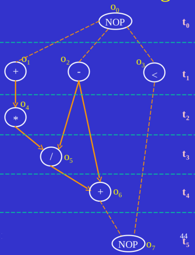

## VLSI scheduler

**Currently this script only supports resource constrained scheduling**

### Dependencies
- Python
- lp-solve

### Installing lp-solve
On ubuntu, lp-solve can be installed as follows - 

``` sudo apt-get install lp-solve ```

**As of now it can only be used on linux systems (tested on ubuntu 16.04) as some linux specific commands has been used**

### Quickstart
A sample operation control graph has been provided in the repository.
To see the script in action, please follow the following steps
- Clone this repo
- Open the cloned repo in terminal
- Run ``` python scheduler.py ```
- You will be provided with a schedule on terminal, also output files for both the linear programming model
  and the output will be created in the same directory
  
### How it works?
The script requires the operation control graph as an input. This graph can be provided as a json input. That is
a json file containing the definition of the graph along with some other parameters has to be present in 
the same directory as the source code. Currently a sample graph called **ocg.json** is already present in the repo.
This file can be editted to provide a different graph input to solve and schedule.

### How to create the json graph
Given below is a sample graph in json:

```
{
	"total_ops": 8,
	"csteps_estimate": 6,
	"graph": {
		"0": [1, 2, 3],
		"1": [4],
		"2": [5, 6],
		"3": [7],
		"4": [5],
		"5": [6],
		"6": [7]
	},
	"op_types_number": "4",
	"op_types": {
		"0": [0, 7],
		"1": [1, 2, 6],
		"2": [4, 5],
		"3": [3]
	},
	"op_instances": {
		"0": 1,
		"1": 1,
		"2": 1,
		"3": 1
	},
	"var_type": "bin"
}

```

The above json file corresponds to the following graph



- The json must define total number of nodes, that is operations including the **NOP operations**
- Next it must define the estimated csteps or the desired csteps.
- Then the graph. Here each node/operation is given a number. The list corresponding to a given operation number signifies
  the operations that are dependent on the given operation. For example, in the above json file, the list corresponding 
  to 2 contains 5 and 6 which means, 5 and 6 are dependent on 2. This can be verified from the picture where it can be seen
  that o5(/) and o6(+) depends on o2 (-). In this way the graph is created. This is nuothing but **adjajency list
  represention** of the OCG. In the graph declaration, NOP steps must be present.
- Next we need to mention the number of operator(resource) type available. Here it is 4, namely - multiplication(division), 
  addition(substraction), lesser than and NOP (which is a dummy operator).
- Next we need to mention what are the operations present under each operator/resource type.
  For each operator type we need to provide a list of operations. For example, the list for 1 contains 1, 2 and 6. That is
  operations 1, 2 and 6 are of type 1. From the picture it can be verified that 1, 2 and 6 are either addition 
  or substraction operation which can be considered as one, since for them we use the same resource 
  (adder/substractor module)
- Finally we need to mention the variable type of our ILP problem. In this case it is **bin**(binary).

Finally we are done. On running scheduler.py we will be presented with the following output

```
Model generated and stored in lp_model.txt
Running lp_solver on lp_model.txt...
Processing output file generated by lp_solver...


Operation 7 should be scheduled on 5 cstep

Operation 0 should be scheduled on 0 cstep

Operation 1 should be scheduled on 1 cstep

Operation 2 should be scheduled on 2 cstep

Operation 3 should be scheduled on 1 cstep

Operation 4 should be scheduled on 2 cstep

Operation 5 should be scheduled on 3 cstep

Operation 6 should be scheduled on 4 cstep


Processing completed
Outpput stored in output.txt

```

As mentioned, the ILP model will be generated and stored as lp_model.txt and output (schedule) will be stored as output.txt
in the same directory

### Limistaions
- Currently it is assumed that number of resources available for all resource types is 1.
- It is also assumed that propagation delay for all operations is 1.

These will be removed in next iteration.
